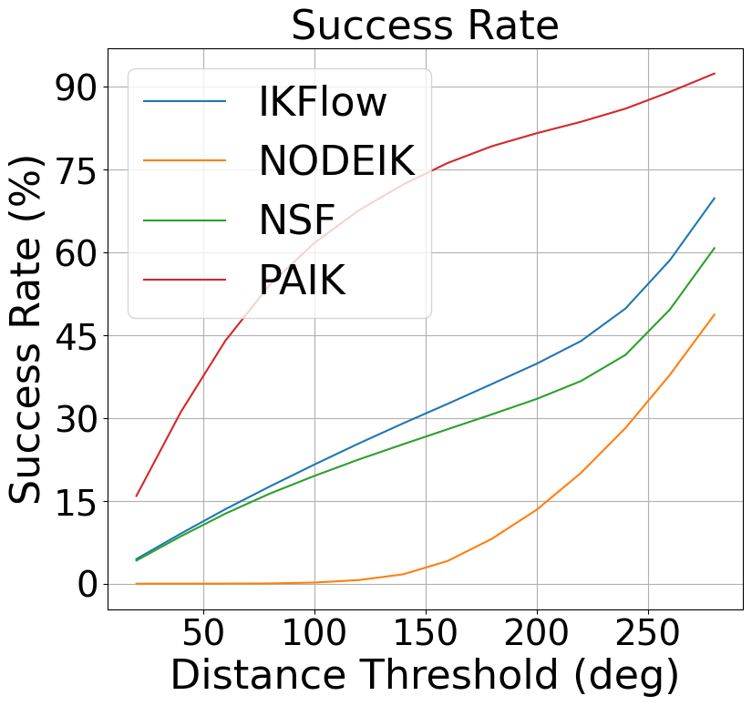

# PAIK: Posture-Aware Inverse Kinematics
Generic and efficient framework for posture constrained Inverse Kinematics. Open source implementation to the paper ["PAIK: Posture-Aware Inverse Kinematics"]()

Runtime and accuracy for the Franka Panda:


## Setup for both inference and training

The only supported OS is `Ubuntu == 20.04`. 

``` bash
git clone https://github.com/duckhanson/PAIK.git && cd PAIK
conda create paik python=3.9.12
conda install pytorch==2.0.1 torchvision==0.15.2 torchaudio==2.0.2 pytorch-cuda=11.8 -c pytorch -c nvidia
python install .
pip install hnne
python -m ipykernel install --user --name paik --display-name "paik"
```


## Getting started

### Inference
**> Example 1: Use PAIK to generate IK solutions for the Franka Panda**
```
python example/ikp.py
```
**> Example 2: Use PAIK to generate posture-constrained IK solutions for the Franka Panda**
```
python example/posture_constrained_ikp.py
```
**> Example 3: Use PAIK to generate diverse IK solutions for the Franka Panda**
```
python example/diversity.py
```
**> Example 4: Visualize all experiments**
run example/display_results.ipynb




### Train
**> Example 5: Train a new model**
```
python example/sweep.py
```

## Possible issues:

### Install issues:
1. ERROR: Could not find a version that satisfies the requirement torch==2.0.1+cu118 (from paik) ERROR: No matching distribution found for torch==2.0.1+cu118

    Ans: try 
    ``` bash
    conda install pytorch==2.1.2 torchvision==0.16.2 torchaudio==2.1.2 pytorch-cuda=11.8 -c pytorch -c nvidia
    ```

### Run issues:
1. RuntimeError: "addmm_cuda" not implemented for 'Int'

    Ans: your gpu may not support int operations, so replace zuko/nn.py:181

    ``` python
    precedence = adjacency.int() @ adjacency.int().t() == adjacency.sum(dim=-1)
    ```

    with 

    ``` python
    precedence = adjacency.float() @ adjacency.float().t() == adjacency.sum(dim=-1)
    ```

## Citation
If this project is used in your work, it would be appreciated if you cite the PAIK paper:
``` bibtex
@ARTICLE{}
```

    
## References
``` bibtex
@ARTICLE{9793576,
  author={Ames, Barrett and Morgan, Jeremy and Konidaris, George},
  journal={IEEE Robotics and Automation Letters}, 
  title={IKFlow: Generating Diverse Inverse Kinematics Solutions}, 
  year={2022},
  volume={7},
  number={3},
  pages={7177-7184},
  doi={10.1109/LRA.2022.3181374}
}

@inproceedings{park2022nodeik,
  title={NODEIK: Solving Inverse Kinematics with Neural Ordinary Differential Equations for Path Planning},
  author={Park, Suhan and Schwartz, Mathew and Park, Jaeheung},
  booktitle={2022 22nd International Conference on Control, Automation and Systems (ICCAS)},
  pages={944--949},
  year={2022},
  organization={IEEE}
}

@software{rozet2022zuko,
  title = {{Zuko}: Normalizing flows in PyTorch},
  author = {Rozet, François and others},
  year = {2022},
  doi = {10.5281/zenodo.7625672},
  license = {MIT},
  url = {https://pypi.org/project/zuko},
}

@article{hnne,
  title={Hierarchical Nearest Neighbor Graph Embedding for Efficient Dimensionality Reduction},
  author={M. Saquib Sarfraz, Marios Koulakis, Constantin Seibold, Rainer Stiefelhagen},
  booktitle = {Proceedings of the IEEE Conference on Computer Vision and Pattern Recognition (CVPR)},
  year = {2022}
}

```


